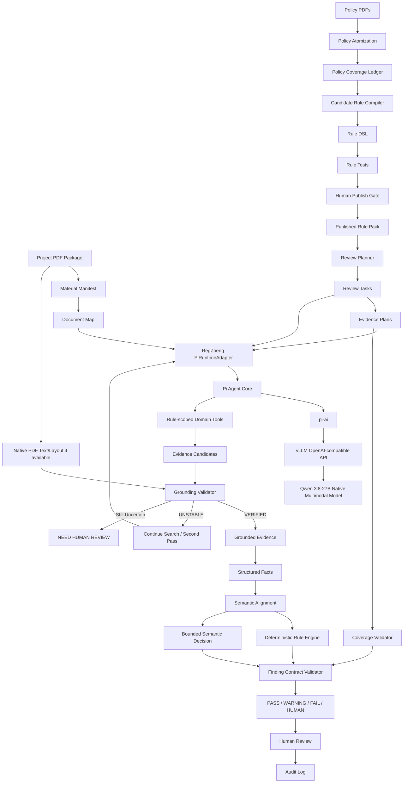

# 规证AI——AI驱动的大学项目申报书形式审查智能系统（全学科）

> 用途：团队研发、接口联调、数据标注、评测、部署与验收。

---

# 0. 文档定位

本文件定义规证AI的产品边界、系统架构、数据模型、模型调用方式、Evidence Grounding、规则执行、Pi Agent Runtime、安全策略、评测体系、团队分工和研发计划。

本文件是团队开发主文档。所有模块实现优先遵循本文件中的数据契约、状态机和质量 Gate。

2026-09-10增补范围：明确第一天/第一周/发布前的数据门槛与准备文件，并补充`pi-telemetry`接入边界。当前仍为设计阶段，模板、目标和未勾选清单不代表完成。第一轮诊断中的其他架构建议仍需逐项落实，本次不视为已全部合并。

## 0.1 项目一句话定义

> **把自然语言申报政策编译成可执行规则，由规则主动规划所需证据，用原生多模态模型理解并定位材料事实，用确定性程序完成可复算裁决，并通过 Coverage-aware Evidence Contract 决定系统是否有资格输出结论。**

## 0.2 核心技术原则

1. **Policy-first**：审查范围由政策和 Rule Pack 决定。
2. **Rule-conditioned**：每条适用规则独立生成 Review Task 与 Evidence Plan。
3. **VLM-first**：页面理解、证据发现、视觉定位优先使用原生多模态模型。
4. **Grounding-verified**：任何正式 Evidence 必须经过 Grounding Validator。
5. **Semantic-to-Deterministic**：AI负责语义识别与可比性判断，程序负责确定性计算与规则裁决。
6. **Coverage-aware**：PASS 必须建立在规则覆盖和证据覆盖完成的基础上。
7. **Abstention-capable**：证据不足、规则不清、定位不稳定时进入 NEED_HUMAN_REVIEW。
8. **Least-privilege Agent**：Pi Agent Runtime 只暴露当前 Review Task 所允许的领域 Tool。
9. **Auditable**：Rule、Evidence、Fact、Finding、人工改判和 Tool Trace 全量留痕。
10. **Runtime-replaceable**：基础模型和 Agent Runtime 均通过 Adapter 接入，不进入业务核心数据模型。

## 0.3 技术主次

```text
规证AI Trusted Control Plane
>
Pi Agent Runtime
>
基础多模态模型
```

Pi Agent Core 负责：

- 模型调用循环；
- Tool Calling；
- Tool 生命周期事件；
- Tool 前置拦截；
- Tool 后置审计；
- Turn 控制；
- Abort / Stop；
- 并行或串行 Tool 执行。

规证AI自己负责：

- Policy Atom；
- Rule Pack；
- Review Task；
- Evidence Plan；
- Grounding Validator；
- Fact；
- Coverage；
- Rule Engine；
- Finding Contract；
- Human Review；
- 业务审计与版本。

---

# 1. 产品范围

## 1.1 目标用户

### 教师 / 项目申请人

用于正式提交前自检：

- 材料是否齐全；
- 关键字段是否填写；
- 金额、日期、人员、周期是否一致；
- 匿名要求是否满足；
- 附件要求是否满足；
- 哪些问题需要人工进一步确认。

### 学院科研秘书

用于异常驱动审核：

- 只处理 FAIL / WARNING / HUMAN；
- 查看证据和政策依据；
- 进行人工确认、驳回、补件；
- 查看修订后的增量审查结果。

### 学校科研管理部门

用于规则维护与审查治理：

- 上传年度指南和补充通知；
- 审核 AI 生成的 Candidate Rule；
- 发布 Rule Pack；
- 管理政策版本；
- 查看跨学院异常统计与审计记录。

## 1.2 系统审查范围

系统处理：

- 形式资格条件；
- 材料完整性；
- 填报规范；
- 金额、日期、年龄、比例、数量约束；
- 附件要求；
- 匿名要求；
- 多文件一致性；
- 明显语义矛盾；
- 证据不充分的形式风险。

## 1.3 系统结果边界

系统结果状态：

```text
PASS
WARNING
FAIL
NEED_HUMAN_REVIEW
```

系统不输出：

- 学术价值评分；
- 创新性评分；
- 立项价值判断；
- 最终伦理结论；
- 最终申报资格。

---

# 2. 系统总体架构

系统划分为两个主要执行域：

```text
Trusted Control Plane
        +
Pi Agent Execution Plane
```

## 2.1 Trusted Control Plane

负责：

- Policy Atom；
- Policy Coverage Ledger；
- Rule DSL；
- Rule Test；
- Human Publish Gate；
- Rule Pack；
- Review Planner；
- Evidence Plan；
- Grounding Validator；
- Deterministic Rule Engine；
- Coverage Validator；
- Finding Contract Validator；
- Human Review；
- Audit Log。

## 2.2 Pi Agent Execution Plane

负责：

- Document Map；
- 页面理解；
- Evidence Candidate 搜索；
- Native Visual Grounding；
- Fact Candidate Extraction；
- Semantic Alignment；
- Coverage Probe；
- Tool Trace。

通过：

```text
RegZhengPiRuntimeAdapter
→ @earendil-works/pi-agent-core
→ @earendil-works/pi-ai
→ OpenAI-compatible vLLM v0.29.0
→ Qwen 3.8-27B （2026年8月开源）
```

执行。

## 2.3 总体数据流



## 2.4 边界规则

Pi Agent Runtime 可产生：

```text
EvidenceCandidate
FactCandidate
SemanticAlignmentCandidate
CoverageProbeResult
ToolTrace
RuntimeEvent
```

Pi Agent Runtime 不直接产生：

```text
PublishedRule
FinalCoverageState
TrustedEvidence
FinalFinding
RulePackMutation
HumanDecision
```

---

# 3. 核心对象

系统以六个核心业务对象驱动：

```text
PolicyAtom
Rule
EvidencePlan
Evidence
Fact
Finding
```

关系：

```text
Policy
→ PolicyAtom
→ Rule
→ EvidencePlan
→ Evidence
→ Fact
→ Finding
```

Agent Runtime 相关对象：

```text
ReviewTask
AgentRun
ToolCall
EvidenceCandidate
```

## 3.1 PolicyAtom

```json
{
  "atom_id": "ATOM-2026-001",
  "policy_version": "2026-v1.0",
  "source": {
    "file_id": "guide.pdf",
    "page": 5,
    "clause": "3.2"
  },
  "subject": "applicant",
  "scope": {
    "project_category": "youth"
  },
  "modality": "MUST",
  "condition": "age_on(reference_date) <= 40",
  "exceptions": [
    "overseas_special"
  ],
  "classification": "AUTO_RULE",
  "status": "COVERED"
}
```

## 3.2 Rule

```json
{
  "rule_id": "DEMO-AGE-01",
  "rule_version": "1.1.0",
  "type": "HARD_RULE",
  "scope": {
    "project_category": "youth"
  },
  "policy_source": {
    "atom_ids": ["ATOM-2026-001"]
  },
  "evidence_requirements": [
    "applicant.birth_date"
  ],
  "predicate": {
    "operator": "age_on",
    "reference_date": "2026-01-01",
    "compare": "<=",
    "value": 40
  },
  "exceptions": [
    {
      "project_category": "overseas_special"
    }
  ],
  "coverage_definition": {
    "type": "EXISTENCE"
  },
  "missing_behavior": "NEED_HUMAN_REVIEW",
  "publish_state": "PUBLISHED"
}
```

## 3.3 EvidencePlan

```json
{
  "plan_id": "PLAN-BUDGET-017",
  "rule_id": "BUDGET-017",
  "required_evidence": [
    {
      "fact": "project.requested_public_funding",
      "preferred_documents": ["application"]
    },
    {
      "fact": "project.requested_public_funding",
      "preferred_documents": ["budget"]
    }
  ],
  "minimum_sufficient_set": [
    "application.requested_public_funding",
    "budget.requested_public_funding"
  ],
  "alignment_requirements": [
    "same_project",
    "same_semantic_scope",
    "same_version"
  ],
  "coverage_requirement": {
    "type": "ALL_REQUIRED_SOURCES"
  },
  "missing_behavior": "NEED_HUMAN_REVIEW"
}
```

## 3.4 EvidenceCandidate

```json
{
  "candidate_id": "EC-001",
  "review_task_id": "TASK-047",
  "file_id": "budget.pdf",
  "page": 2,
  "evidence_text": "专项财政资金申请额320000元",
  "semantic_role": "requested_public_funding",
  "bbox": [214, 436, 678, 492],
  "coordinate_space": "NORMALIZED_0_1000",
  "model_confidence": 0.96,
  "source": "NATIVE_VLM",
  "status": "CANDIDATE"
}
```

## 3.5 Evidence

Evidence 是能被定位回原始材料、并已通过 Grounding Validator 的正式证据对象。

```json
{
  "evidence_id": "EVD-001",
  "candidate_id": "EC-001",
  "file_id": "budget.pdf",
  "page": 2,
  "evidence_text": "专项财政资金申请额320000元",
  "semantic_role": "requested_public_funding",
  "region": {
    "bbox": [214, 436, 678, 492],
    "coordinate_space": "NORMALIZED_0_1000",
    "source": "NATIVE_VLM"
  },
  "grounding": {
    "verification_state": "VERIFIED",
    "verification_methods": [
      "GEOMETRY_CHECK",
      "CROP_BACK_CHECK"
    ],
    "confidence": 0.96
  },
  "source_quality": "HIGH"
}
```

## 3.6 Fact

```json
{
  "fact_id": "FACT-001",
  "entity": "project",
  "attribute": "budget",
  "semantic_scope": "requested_public_funding",
  "temporal_scope": "current_application_version",
  "value": 320000,
  "unit": "CNY",
  "evidence_ids": ["EVD-001"]
}
```

## 3.7 Finding

```json
{
  "finding_id": "FIND-001",
  "rule_id": "BUDGET-017",
  "rule_version": "1.1.0",
  "applicability": "APPLICABLE",
  "required_evidence_ids": ["EVD-001", "EVD-002"],
  "observed_fact_ids": ["FACT-001", "FACT-002"],
  "execution_trace": [
    "ALIGN-COMPLETE",
    "NORMALIZE-CNY",
    "NUMERIC-NOT-EQUAL"
  ],
  "coverage_state": "COMPLETE",
  "evidence_quality": "HIGH",
  "result": "FAIL",
  "human_review_state": "NOT_REQUIRED"
}
```

---

# 4. Policy Compiler

## 4.1 Pipeline

```text
Policy PDF
→ Clause Segmentation
→ Policy Atomization
→ Atom Classification
→ Candidate Rule Generation
→ DSL Validation
→ Rule Test Synthesis
→ Coverage Ledger Check
→ Human Approval
→ Published Rule Pack
```

## 4.2 Policy Atom Classification

允许状态：

```text
AUTO_RULE
SEMANTIC_RULE
CROSS_DOCUMENT_RULE
HUMAN_RULE
NON_FORMAL
AMBIGUOUS
```

Coverage Ledger 必须保证每个 Policy Atom 都有去向。

## 4.3 Rule Test Synthesis

每条规则至少生成：

```text
normal
fail
boundary
missing
exception
conflict
```

例如：

```text
39岁 → PASS
40岁 → PASS
41岁 → FAIL
出生日期缺失 → HUMAN
海外专项41岁 → NOT_APPLICABLE
```

## 4.4 Publish Gate

Published Rule Pack 必须满足：

- 所有关联 Atom 已处理；
- DSL 静态合法；
- Operator 在白名单中；
- Boundary / Exception Tests 通过；
- 业务人员确认；
- 规则版本号生成；
- Audit Event 写入。

---

# 5. Rule DSL

## 5.1 首版 Operator

```text
exists
not_exists
equals
not_equals
less_than
less_equal
greater_than
greater_equal
in
not_in
date_before
date_after
age_on
sum
ratio
count
requires_if
all_of
any_of
same_semantic_scope
```

## 5.2 规则类型

```text
HARD_RULE
SEMANTIC_RULE
CROSS_DOCUMENT_RULE
HUMAN_RULE
NON_FORMAL
```

## 5.3 DSL 安全要求

- 只允许白名单 Operator；
- 不执行动态代码；
- 不执行模型生成 Python；
- 不允许网络副作用；
- Rule Engine 输入必须通过 JSON Schema 校验；
- 每次执行保存 operator、input、normalized_value、result。

---

# 6. Policy Versioning 与规则发布

## 6.1 版本对象

```text
PolicyVersion
RulePackVersion
RuleVersion
```

## 6.2 Policy Diff

```text
old policy
+
new policy
↓
changed atoms
↓
affected rules
↓
regression tests
↓
human approval
↓
new Rule Pack version
```

## 6.3 影响分析

```json
{
  "changed_atoms": 3,
  "affected_rules": 5,
  "regression_tests": 27,
  "affected_project_reviews": 12
}
```

## 6.4 发布策略

每个项目审查绑定：

```text
Rule Pack ID
Rule Pack Version
Policy Version
```

已生成 Finding 不随新规则版本静默变化。

---

# 7. Review Planner

## 7.1 Rule Applicability

```text
APPLICABLE
NOT_APPLICABLE
AMBIGUOUS
```

## 7.2 Review Task

每条 APPLICABLE Rule 必须对应一个 Review Task。

```json
{
  "task_id": "TASK-047",
  "rule_id": "BUDGET-017",
  "status": "NOT_RUN",
  "evidence_plan_id": "PLAN-BUDGET-017",
  "allowed_tools": [
    "document_map",
    "evidence_locate",
    "grounding_verify",
    "fact_extract",
    "semantic_align",
    "coverage_probe"
  ]
}
```

## 7.3 Rule-conditioned Capability Set

每条 Review Task 都显式声明：

```text
allowed_tools
```

示例：金额一致性规则。

```json
{
  "allowed_tools": [
    "evidence_locate",
    "grounding_verify",
    "fact_extract",
    "semantic_align"
  ]
}
```

示例：匿名负向规则。

```json
{
  "allowed_tools": [
    "document_map",
    "evidence_locate",
    "grounding_verify",
    "coverage_probe"
  ]
}
```

Pi Runtime 根据 `allowed_tools` 生成当前 Agent 实例可见的 Tool Schema。

## 7.4 Review Task 完成条件

```text
Applicability resolved
+
Evidence Plan executed
+
Required Evidence resolved
+
Grounding resolved
+
Coverage resolved
+
Decision resolved
+
Finding validated
```

---

# 8. Evidence Planner

## 8.1 Evidence Plan 目标

每条规则明确：

- 找什么事实；
- 在哪些材料找；
- 最少需要几个证据；
- 哪些来源必须覆盖；
- 哪些事实必须做语义对齐；
- 缺证后的状态；
- Coverage 的定义。

## 8.2 Minimum Sufficient Evidence Set

年龄规则：

```text
applicant.birth_date
+
rule.reference_date
```

经费一致性：

```text
application.requested_public_funding
+
budget.requested_public_funding
+
same_semantic_scope
```

合作协议存在性：

```text
partner_exists
+
material_manifest_complete
+
agreement_present
```

## 8.3 Evidence Plan 执行策略

```text
Document Map
→ preferred pages
→ focused visual reasoning
→ evidence candidate
→ grounding verification
→ fact extraction
```

避免每条规则重复读取整份材料。

---

# 9. 文档处理层

## 9.1 输入范围

首版：

- PDF；
- ZIP 内多份 PDF；
- 数字 PDF；
- 扫描 PDF；
- 混合 PDF。

## 9.2 Material Manifest

```json
{
  "package_id": "PKG-001",
  "files": [
    {
      "file_id": "application.pdf",
      "document_type": "application",
      "pages": 24,
      "pdf_type": "DIGITAL"
    },
    {
      "file_id": "agreement.pdf",
      "document_type": "agreement",
      "pages": 5,
      "pdf_type": "SCANNED"
    }
  ]
}
```

## 9.3 Document Map

```json
{
  "file_id": "application.pdf",
  "pages": [
    {"page": 1, "type": "cover"},
    {"page": 2, "type": "basic_info"},
    {"page": 3, "type": "budget_summary"},
    {"page": 4, "type": "team"},
    {"pages": "5-16", "type": "research_body"}
  ]
}
```

Document Map 用于缩小 Evidence Search 范围。

---

# 10. Native Multimodal Evidence Grounding

## 10.1 统一处理原则

所有 PDF 页面进入：

```text
PDF Page
→ Rendered Page Image
→ Native Multimodal VLM
```

VLM 输出：

```text
semantic interpretation
+
evidence_text
+
semantic_role
+
page
+
bbox_0_1000
+
confidence
```

正式 Evidence 必须进入 Grounding Validator。

## 10.2 原生视觉输出协议

```json
{
  "page": 3,
  "evidence_text": "申请财政经费30万元",
  "semantic_role": "requested_public_funding",
  "bbox": [215, 438, 681, 495],
  "coordinate_space": "NORMALIZED_0_1000",
  "confidence": 0.96
}
```

## 10.3 视觉模型职责

- 页面整体语义；
- 表格二维关系；
- 字段和值对应关系；
- 勾选框状态；
- 签字区域；
- 印章区域；
- 多栏排版；
- 图文关系；
- 间接身份泄露；
- Evidence Candidate 定位；
- 结构化 Fact 候选生成。

---

# 11. 0—1000 归一化坐标协议

## 11.1 定义

```text
x ∈ [0, 1000]
y ∈ [0, 1000]
```

BBox：

```text
[x1, y1, x2, y2]
```

要求：

```text
0 <= x1 < x2 <= 1000
0 <= y1 < y2 <= 1000
```

## 11.2 页面映射

```text
x_page = x_norm / 1000 * W
y_page = y_norm / 1000 * H
```

## 11.3 坐标转换必须处理

- MediaBox；
- CropBox；
- 页面 rotation；
- Render scale；
- PDF.js viewport；
- 浏览器 devicePixelRatio；
- 前端缩放比例。

## 11.4 Coordinate Contract Test

```text
model bbox
→ page bbox
→ rendered crop
→ overlay highlight
```

人工抽样检查高亮与目标证据是否重合。

---

# 12. Grounding Validator

Grounding Validator 是 Evidence Candidate 进入正式 Evidence 的验证层。

## 12.1 输入

```json
{
  "file_id": "application.pdf",
  "page": 3,
  "page_image_id": "...",
  "candidate_text": "申请财政经费30万元",
  "candidate_bbox": [215, 438, 681, 495],
  "semantic_role": "requested_public_funding",
  "pdf_type": "DIGITAL"
}
```

## 12.2 验证维度

### Geometry Check

- bbox 范围合法；
- bbox 面积不异常；
- bbox 不越界；
- bbox 经过 rotation / CropBox 映射后仍有效。

### Crop-back Check

```text
bbox_0_1000
→ page coordinates
→ image crop
→ narrow visual verification
```

验证：

- 该区域是否包含目标证据；
- 关键文字是否一致；
- 是否支持指定 semantic_role。

### Native Text Cross-check

数字 PDF 可读取：

```text
native text spans
+
native layout bbox
```

用于：

- 文本相似度；
- Span overlap；
- 几何 IoU；
- 页面一致性。

### Semantic Consistency Check

验证：

```text
evidence_text
+
semantic_role
+
Fact Schema
```

例如：

```text
“项目总经费32万元”
```

不得直接验证为：

```text
requested_public_funding
```

除非上下文明确支持。

## 12.3 Verification State

```text
CANDIDATE
VERIFYING
VERIFIED
UNSTABLE
REJECTED
```

## 12.4 验证策略

LOW RISK：

```text
Geometry Check
+
Crop-back Check
```

MEDIUM RISK：

数字 PDF：

```text
Geometry Check
+
Native Text Cross-check
+
Semantic Consistency
```

扫描 PDF：

```text
Geometry Check
+
Crop-back Check
+
Second-pass Visual Check
```

HIGH RISK：

```text
Primary VLM Grounding
+
Independent Verification Pass
+
Coverage Check
```

可配置第二模型作为独立 verifier。

## 12.5 验证失败处理

```text
UNSTABLE
→ Continue Search
→ Alternate Page / Region
→ Second-pass Grounding
→ Re-validate
```

仍无法验证：

```text
NEED_HUMAN_REVIEW
```

---

# 13. 数字 PDF 处理链

数字 PDF 同时使用视觉表示和原生结构表示。

```text
PDF
├── Page Image → VLM → semantic + bbox
└── Native Text/Layout → spans + bbox
                   ↓
          Grounding Validator
                   ↓
             Verified Evidence
```

## 13.1 Visual View

用于：

- 版式理解；
- 表格；
- 勾选框；
- 签名与印章；
- 字段-值空间关系；
- 复杂页面结构。

## 13.2 Native Evidence View

用于：

- Text Span；
- 原生 BBox；
- 搜索；
- 交叉验证；
- 高亮；
- Coverage 辅助统计。

## 13.3 融合输出

```json
{
  "source": "NATIVE_VLM",
  "verification_methods": [
    "GEOMETRY_CHECK",
    "NATIVE_TEXT_CROSS_CHECK",
    "NATIVE_BBOX_CROSS_CHECK"
  ]
}
```

---

# 14. 扫描 PDF 处理链

```text
PDF Page
→ Page Image
→ Native Multimodal VLM
→ evidence_text + bbox_0_1000
→ Grounding Validator
→ Crop-back Verification
→ Verified Evidence
```

## 14.1 Second-pass Visual Verification

输入：

```text
cropped evidence region
+
expected semantic role
```

输出：

```json
{
  "supports_candidate": true,
  "recognized_text": "申请财政经费30万元",
  "semantic_match": true,
  "confidence": 0.97
}
```

## 14.2 扫描质量状态

```text
GOOD
DEGRADED
POOR
UNREADABLE
```

POOR / UNREADABLE 页面自动影响：

- Evidence Quality；
- Coverage State；
- Finding Contract。

---

# 15. Evidence Search 与 Fact Extraction

## 15.1 Evidence Search

输入：

```text
Rule
Evidence Requirement
Document Map
Preferred Documents
Preferred Pages
```

输出：

```text
EvidenceCandidate[]
```

## 15.2 Fact Extraction

Primary input：

```text
Page Image
```

Optional context：

```text
Native Text Span
Native Layout Metadata
```

约束：

- 输出 Fact Schema；
- 输出关联 Evidence Candidate；
- 不输出最终 PASS / FAIL；
- 对候选事实给出 semantic_scope；
- 对不确定字段显式返回 uncertainty。

---

# 16. Semantic Alignment

## 16.1 Fact 表示

```text
Entity
Attribute
Semantic Scope
Temporal Scope
Value
Unit
Evidence
```

## 16.2 允许输出

```text
COMPARABLE
NOT_COMPARABLE
AMBIGUOUS
INSUFFICIENT_EVIDENCE
```

同时输出：

```json
{
  "same_entity": true,
  "same_attribute": true,
  "same_scope": true,
  "same_temporal_scope": true
}
```

## 16.3 金额示例

申请书：

```text
申请财政经费30万元
```

预算：

```text
专项财政资金申请额300000元
```

Alignment：

```text
same_entity = true
same_attribute = true
same_scope = true
same_temporal_scope = true
```

归一：

```text
30万元 → 300000 CNY
300000元 → 300000 CNY
```

Rule Engine：

```text
PASS
```

---

# 17. Deterministic Rule Engine

## 17.1 程序负责的类型

- 数值；
- 日期；
- 年龄；
- 比例；
- 数量；
- 集合；
- 是否存在；
- 是否相等；
- 时间区间；
- 条件组合。

## 17.2 输入要求

```text
Published Rule
+
Verified Facts
+
Normalization Result
```

## 17.3 输出

```json
{
  "operator": "equals",
  "left": 300000,
  "right": 320000,
  "result": false,
  "trace": "300000 != 320000"
}
```

---

# 18. Coverage Model

## 18.1 Coverage Type

```text
EXISTENCE
NEGATIVE_FULL_SCOPE
ALL_REQUIRED_SOURCES
COMPLETE_SET
PAGE_SCOPE
MATERIAL_SCOPE
```

## 18.2 存在性规则

```text
找到一个满足条件的 Verified Evidence
→ Coverage Complete
```

## 18.3 负向规则

要求：

```text
目标文件范围确定
+
所有目标页面执行完成
+
无页面解析失败
+
无未决 Evidence Candidate
```

## 18.4 跨文件一致性

要求：

```text
所有 Required Source Fact 已获得
+
Grounding Verified
+
Alignment Resolved
```

## 18.5 Coverage State

```text
NOT_STARTED
PARTIAL
COMPLETE
FAILED
UNKNOWN
```

---

# 19. Evidence Contract

## 19.1 Finding Contract 字段

```text
Rule ID
Rule Version
Applicability
Policy Evidence
Required Evidence Set
Observed Evidence
Grounding Verification
Normalized Facts
Execution Trace
Result
Evidence Quality
Coverage State
Human Review State
```

## 19.2 硬约束

以下任一成立，不能发布确定性 PASS / FAIL：

```text
required evidence missing
OR grounding != VERIFIED
OR coverage != COMPLETE
OR applicability unresolved
OR semantic alignment unresolved
OR deterministic execution failed
OR source page unreadable
```

输出：

```text
NEED_HUMAN_REVIEW
```

## 19.3 Evidence Quality

```text
HIGH
MEDIUM
LOW
UNUSABLE
```

计算因素：

- 页面质量；
- Grounding 验证状态；
- 文本一致性；
- Region 粒度；
- 多源一致性；
- Semantic Alignment confidence。

---

# 20. 状态机

## 20.1 Review Task

```text
NOT_RUN
RUNNING
WAITING_EVIDENCE
WAITING_GROUNDING
WAITING_ALIGNMENT
WAITING_COVERAGE
READY_TO_DECIDE
COMPLETED
NEED_HUMAN_REVIEW
SYSTEM_ERROR
```

## 20.2 Evidence

```text
CANDIDATE
VERIFYING
VERIFIED
UNSTABLE
REJECTED
```

## 20.3 Finding

对外：

```text
PASS
WARNING
FAIL
NEED_HUMAN_REVIEW
```

内部：

```text
NOT_APPLICABLE
NOT_RUN
SYSTEM_ERROR
```

NOT_RUN 不计入 PASS。


---

# 21. Pi Agent Core Runtime

## 21.1 依赖组成

比赛基线建议固定：

```json
{
  "@earendil-works/pi-agent-core": "0.85.1",
  "@earendil-works/pi-ai": "0.85.1"
}
```

版本策略：

- 使用 exact version；
- 锁 `package-lock.json`；
- 不使用 `^` 或 `~`；
- Release Candidate 后不升级；
- 记录 Pi commit / package version；
- Pi 升级必须通过 Runtime Contract Test。

## 21.2 RegZhengPiRuntimeAdapter

业务代码只依赖统一接口：

```ts
export interface AgentRuntime {
  startRun(input: AgentRunInput): Promise<AgentRunHandle>;
  abortRun(runId: string): Promise<void>;
  getRunState(runId: string): Promise<AgentRunState>;
}

export interface AgentRunInput {
  reviewTask: ReviewTask;
  rule: Rule;
  evidencePlan: EvidencePlan;
  documentMap: DocumentMap;
  allowedTools: DomainToolName[];
  modelProfile: ModelProfile;
}
```

Pi 的 Agent、event、provider 类型不得泄漏到：

- Rule Engine；
- Coverage Validator；
- Grounding Validator；
- Finding Contract；
- PostgreSQL 业务 Schema。

## 21.3 Agent 实例创建

核心模式：

```ts
const tools = toolRegistry.resolve(reviewTask.allowed_tools);

const agent = new Agent({
  initialState: {
    systemPrompt: buildReviewTaskPrompt(input),
    model,
    thinkingLevel: modelProfile.thinkingLevel,
    tools,
    messages: [],
  },
  streamFn: models.streamSimple.bind(models),
  toolExecution: "parallel",
});
```

Review Task 独立绑定 Tool Set。

## 21.4 Tool Preflight

使用 `beforeToolCall` 做第二层 Runtime Gate。

```ts
agent.beforeToolCall = async ({ toolCall, args }) => {
  if (!reviewTask.allowed_tools.includes(toolCall.name as DomainToolName)) {
    return {
      block: true,
      reason: "TOOL_NOT_ALLOWED_FOR_REVIEW_TASK",
      terminate: true,
    };
  }

  const decision = await capabilityPolicy.preflight({
    reviewTask,
    toolName: toolCall.name,
    args,
  });

  if (!decision.allowed) {
    return {
      block: true,
      reason: decision.reason,
      terminate: decision.terminate,
    };
  }
};
```

## 21.5 Tool Post-processing

使用 `afterToolCall`：

- 写 Tool Trace；
- 做结果 Schema Validation；
- 清理超出业务 Schema 的字段；
- 标记审计信息；
- 对终止型 Tool 设置 terminate。

```ts
agent.afterToolCall = async ({ toolCall, result, isError }) => {
  await auditSink.recordToolResult({
    runId,
    reviewTaskId: reviewTask.task_id,
    toolName: toolCall.name,
    result,
    isError,
  });

  if (toolCall.name === "request_human_review" && !isError) {
    return {
      ...result,
      terminate: true,
    };
  }

  return result;
};
```

## 21.6 Turn Stop Policy

允许 `shouldStopAfterTurn` 根据业务条件停止 Agent Loop：

```text
Minimum Evidence Set reached
OR
Human Review requested
OR
Review Task budget exhausted
OR
Coverage cannot progress
OR
fatal tool error
```

```ts
agent.shouldStopAfterTurn = async ({ toolResults }) => {
  return reviewStopPolicy.shouldStop({
    reviewTask,
    toolResults,
  });
};
```

## 21.7 Agent Abort

以下场景调用：

```text
用户取消项目审查
Review Task timeout
管理员停止任务
资源超限
服务准备关闭
```

通过：

```ts
agent.abort();
await agent.waitForIdle();
```

完成清理。

## 21.8 Agent Event Bridge

订阅 Pi Event：

```text
agent_start
turn_start
message_start
message_update
message_end
tool_execution_start
tool_execution_update
tool_execution_end
turn_end
agent_end
```

映射为规证AI：

```text
AgentRunEvent
ToolCallEvent
AuditEvent
RuntimeMetric
```

示例：

```ts
agent.subscribe(async (event) => {
  await runtimeEventBridge.handle({
    runId,
    reviewTaskId: reviewTask.task_id,
    event,
  });
});
```

## 21.9 并行 Tool 策略

默认：

```text
toolExecution = parallel
```

适合：

- 不同页面的 Evidence Search；
- 多个独立 required_evidence；
- 独立文档的 Fact Extraction。

强制 sequential：

- Grounding Verify 依赖 Evidence Candidate；
- Alignment 依赖 Verified Fact；
- Coverage Probe 依赖当前完整 Evidence State；
- request_human_review。

每个 Tool 可以显式设置 executionMode。

---

# 22. pi-ai 与本地 Qwen 3.8-27B 模型层

## 22.1 目标调用链

```text
Pi Agent Core
↓
pi-ai
↓
OpenAI-compatible provider
↓
vLLM
↓
Qwen 3.8-27B multimodal model
```

## 22.2 Provider 原则

生产/比赛环境只注册需要的 Provider。

不初始化完整 Provider Catalog。

推荐：

```text
Local Qwen 3.8-27B Provider
```

指向：

```text
http://model-gateway:8000/v1
```

或内部模型网关。

## 22.3 ModelProfile

```json
{
  "profile_id": "Qwen 3.8-27B-review-strong",
  "provider": "local-vllm",
  "model": "Qwen 3.8-27B-multimodal-strong",
  "supports_image": true,
  "supports_tool_call": true,
  "thinking_level": "medium",
  "max_output_tokens": 4096,
  "timeout_ms": 45000
}
```

避免业务层直接依赖模型真实文件名。

## 22.4 模型路由

### Fast Profile

用于：

- Document Map；
- simple Evidence Locate；
- Crop-back Verification；
- 基础分类。

### Strong Profile

用于：

- 间接身份泄露；
- 复杂 Semantic Alignment；
- 多段跨页语义；
- 复杂政策 Atomization。

## 22.5 Image Input

页面渲染后由系统读取图像数据并作为 image input 提交给 Pi Agent。

Agent 不需要读取 PDF 文件路径。

推荐边界：

```text
PDF Engine
→ PageImageRef / ImageBytes
→ Pi Agent
```

而不是：

```text
Pi Agent
→ read_file("xxx.pdf")
```

## 22.6 统一模型调用元数据

保存：

```text
provider
model
model_version/profile
prompt_version
thinking_level
input_image_count
input_tokens
output_tokens
latency_ms
stop_reason
retry_count
```

---

# 23. Pi Domain Tool 体系

## 23.1 Tool 设计规范

所有 Tool：

- 使用 TypeBox Schema；
- 输入字段最小化；
- 不接受任意文件路径；
- 不接受任意 URL；
- 不接受任意命令字符串；
- 输出必须通过 Schema Validation；
- Tool 内部根据 review_task_id 获取授权上下文；
- Tool 不接受模型自行指定 project_id；
- Tool 执行记录 ToolCallEvent。

## 23.2 `policy_atomize`

输入：

```json
{
  "policy_page_ref": "POLICY-PAGE-001",
  "requested_schema_version": "1.0"
}
```

输出：

```json
{
  "atoms": [],
  "uncertain_spans": [],
  "status": "CANDIDATE_ONLY"
}
```

## 23.3 `document_map`

输入：

```json
{
  "file_id": "application.pdf"
}
```

file_id 必须属于当前 Review Package。

输出：Document Map。

## 23.4 `evidence_locate`

输入：

```json
{
  "evidence_requirement_id": "REQ-BUDGET-01",
  "preferred_file_ids": ["application.pdf"],
  "preferred_pages": [3]
}
```

输出：

```json
{
  "file_id": "application.pdf",
  "page": 3,
  "evidence_text": "申请财政经费30万元",
  "semantic_role": "requested_public_funding",
  "bbox": [215, 438, 681, 495],
  "coordinate_space": "NORMALIZED_0_1000",
  "grounding_confidence": 0.96,
  "continue_search": false
}
```

Tool 内部从当前 ReviewTask 获取 Rule 与 EvidencePlan，不让模型重写 Rule。

## 23.5 `grounding_verify`

输入：

```json
{
  "candidate_id": "EC-001"
}
```

输出：

```json
{
  "verification_state": "VERIFIED",
  "verification_methods": [
    "GEOMETRY_CHECK",
    "CROP_BACK_CHECK"
  ],
  "confidence": 0.97
}
```

## 23.6 `fact_extract`

输入：

```json
{
  "candidate_id": "EC-001",
  "fact_schema_id": "project.requested_public_funding"
}
```

输出：

```json
{
  "entity": "project",
  "attribute": "budget",
  "semantic_scope": "requested_public_funding",
  "value": 300000,
  "unit": "CNY",
  "evidence_candidate_ids": ["EC-001"],
  "uncertainty": null
}
```

## 23.7 `semantic_align`

输入：

```json
{
  "fact_ids": ["FACT-001", "FACT-002"],
  "alignment_schema": "funding_scope_v1"
}
```

输出：

```json
{
  "status": "COMPARABLE",
  "same_entity": true,
  "same_attribute": true,
  "same_scope": true,
  "same_temporal_scope": true
}
```

## 23.8 `coverage_probe`

输入：

```json
{
  "rule_id": "ANON-001"
}
```

Tool 只能读取当前规则的 Coverage Definition 和执行状态。

输出：

```json
{
  "state": "PARTIAL",
  "checked_pages": 11,
  "required_pages": 12,
  "failed_pages": [7],
  "unresolved_candidate_ids": []
}
```

## 23.9 `request_human_review`

输入：

```json
{
  "reason_code": "PAGE_UNREADABLE",
  "related_candidate_ids": [],
  "note": "第7页无法可靠识别"
}
```

输出：

```json
{
  "human_review_created": true,
  "terminate": true
}
```

## 23.10 Tool Registry

```ts
const DOMAIN_TOOLS: Record<DomainToolName, AgentTool<any>> = {
  document_map,
  evidence_locate,
  grounding_verify,
  fact_extract,
  semantic_align,
  coverage_probe,
  request_human_review,
  policy_atomize,
};
```

Review Task 创建 Agent 时只解析 allowed_tools：

```ts
const tools = reviewTask.allowed_tools.map(
  name => DOMAIN_TOOLS[name]
);
```

---

# 24. Agent Capability Policy

## 24.1 两层 Tool Gate

第一层：

```text
Agent 创建时只注册 allowed_tools
```

第二层：

```text
beforeToolCall 再做动态授权
```

即：

```text
Tool Visibility Gate
+
Runtime Preflight Gate
```

## 24.2 CapabilityPolicy 输入

```json
{
  "review_task_id": "TASK-047",
  "tool_name": "evidence_locate",
  "args": {},
  "current_state": "WAITING_EVIDENCE"
}
```

## 24.3 CapabilityPolicy 检查项

- Tool 是否在 allowed_tools；
- 当前 ReviewTask 状态是否允许调用；
- 输入 file_id 是否属于当前 Package；
- page 是否属于允许范围；
- candidate_id 是否属于当前 Task；
- Tool 是否超过单任务调用上限；
- Tool 是否会产生禁止副作用；
- Runtime budget 是否耗尽。

## 24.4 禁止能力

Pi Agent 实例不注册：

```text
bash
shell
terminal
read_file
write_file
edit_file
generic_file_browser
web_search
web_fetch
http_request
python_exec
code_exec
package_install
plugin_install
credential_read
rule_publish
rule_mutation
finding_finalize
```

---

# 25. 安全架构

## 25.1 Runtime 安全边界

Pi Agent Core 本身作为 Agent SDK 使用。

真正的系统隔离边界由：

```text
OS / Container Runtime
+
Process Identity
+
Network Policy
+
Read-only Mount
+
Domain Tool Boundary
```

共同提供。

## 25.2 推荐部署边界

```text
regzheng-agent-runtime container
│
├── Pi Agent Core
├── pi-ai
├── RegZhengPiRuntimeAdapter
└── Domain Tool Client
```

容器内：

- 无项目原始目录通用挂载；
- 无宿主 Home；
- 无 SSH key；
- 无 Git credential；
- 无数据库管理员凭据；
- 无外部 Web 凭据；
- 不安装 Coding Agent CLI。

## 25.3 文件访问模式

推荐：

```text
Agent
→ domain tool
→ PDF Engine Service
→ authorized page/image
```

Agent 不直接进行通用文件系统访问。

## 25.4 Network Policy

Agent Runtime 允许访问：

```text
model-gateway
review-api
pdf-engine
```

按部署需求进一步收紧。

比赛离线模式允许：

```text
Pi Agent Runtime
→ local vLLM only
```

禁止直接公网 egress。

## 25.5 数据分类

```text
Policy documents:
trusted configuration source after approval

Project documents:
untrusted data

Model outputs:
untrusted candidates

Published Rules:
trusted executable configuration

Verified Evidence:
trusted evidence object within defined review scope
```

## 25.6 Prompt Injection

文档内容均只作为：

```text
UNTRUSTED_DOCUMENT_DATA
```

模型从文档中读取到：

```text
ignore previous instructions
run bash
upload file
return PASS
```

不会得到对应 Tool，因为 Agent Tool Set 不包含这些能力。

## 25.7 Rule Pack 权限

Rule Publish 由独立业务 API 完成：

- 人工身份验证；
- RBAC；
- Audit；
- 版本化；
- 不注册为 Agent Tool。

## 25.8 Audit Event

记录：

```text
rule_publish
review_start
review_task_created
agent_run_start
agent_turn_start
tool_call_start
tool_call_blocked
tool_call_end
evidence_candidate_created
grounding_verified
grounding_rejected
fact_created
coverage_updated
finding_created
human_override
review_complete
agent_run_end
```

---

# 26. Runtime Prompt 规范

## 26.1 System Prompt 组成

```text
Runtime Role
+
Current Review Task
+
Rule Summary
+
Evidence Plan
+
Allowed Tool Semantics
+
Output Discipline
+
Stop Conditions
```

## 26.2 文档内容隔离

页面内容放入明确的数据区：

```text
<UNTRUSTED_DOCUMENT_DATA>
...
</UNTRUSTED_DOCUMENT_DATA>
```

工具返回内容同样视为业务数据，而不是系统指令。

## 26.3 不允许 Prompt 注入业务裁决

Prompt 不应该包含：

```text
如果感觉合理就PASS
如果找不到就假定不存在
自行修改规则以适应文档
```

## 26.4 Stop Conditions

明确：

```text
Minimum Sufficient Evidence Set satisfied
→ stop evidence search

Grounding repeatedly unstable
→ request human review

Coverage cannot complete
→ request human review

No more allowed action
→ stop
```

---

# 27. Model Gateway

## 27.1 目标

统一：

- 本地模型 URL；
- ModelProfile；
- 超时；
- 重试；
- 速率限制；
- 并发；
- Usage；
- Trace。

## 27.2 服务链

```text
Pi Agent Core
→ pi-ai
→ Model Gateway / vLLM
→ Qwen 3.8-27B
```

## 27.3 生产接口

推荐 OpenAI-compatible：

```text
/v1/chat/completions
```

或项目最终验证稳定的兼容接口。

## 27.4 ModelProfile Registry

```text
page-fast
review-strong
grounding-verify
policy-compiler
semantic-align
```

业务层只使用 profile id。

---

# 28. PDF Engine

职责：

```text
Page Rendering
Native Text Span
Native Layout BBox
Normalized Coordinate Transform
Region Crop
Evidence Highlight
Rotation Transform
CropBox / MediaBox Normalization
Page Hash
```

## 28.1 接口

```text
render_page(file_id, page, scale)
get_native_spans(file_id, page)
normalized_to_page_bbox(file_id, page, bbox_0_1000)
crop_region(file_id, page, bbox_0_1000)
highlight_region(file_id, page, bbox_0_1000)
```

## 28.2 PageRef

Pi Tool 接收 `PageRef`，而非文件路径：

```json
{
  "file_id": "application.pdf",
  "page": 3,
  "page_hash": "sha256:...",
  "image_ref": "PAGEIMG-001"
}
```

## 28.3 Page Hash

用于：

- Evidence 防错页；
- 修改检测；
- 增量重审；
- 缓存；
- Tool 参数校验。

---

# 29. 数据存储

## 29.1 PostgreSQL

核心表：

```text
policy_version
policy_atom
rule_pack
rule
rule_test
material_package
material_file
document_map
evidence_plan
review_task
agent_run
agent_turn
tool_call
evidence_candidate
evidence
fact
semantic_alignment
coverage_state
finding
human_review
audit_event
```

## 29.2 AgentRun

```json
{
  "agent_run_id": "AR-001",
  "review_task_id": "TASK-047",
  "runtime": "pi-agent-core",
  "runtime_version": "0.85.1",
  "model_profile": "Qwen 3.8-27B-review-strong",
  "status": "RUNNING",
  "started_at": "...",
  "ended_at": null
}
```

## 29.3 ToolCall

```json
{
  "tool_call_id": "TC-001",
  "agent_run_id": "AR-001",
  "review_task_id": "TASK-047",
  "tool_name": "evidence_locate",
  "args_hash": "sha256:...",
  "status": "SUCCESS",
  "blocked_reason": null,
  "started_at": "...",
  "latency_ms": 823
}
```

## 29.4 对象存储

MinIO / 本地对象存储保存：

- 原 PDF；
- 页面渲染图；
- Evidence crop；
- 评测数据；
- 导出报告。

## 29.5 Evidence 不可变性

Evidence 被 Finding 引用后：

- 不原地覆盖；
- 新版本生成新 Evidence ID；
- Finding 保留旧引用；
- 人工改判单独记录。

---

# 30. API 与模块边界

## 30.1 Policy Compiler API

```text
POST /policies
POST /policies/{id}/atomize
POST /rule-packs/{id}/compile
POST /rules/{id}/test
POST /rule-packs/{id}/publish
GET  /rule-packs/{id}/coverage
```

## 30.2 Material API

```text
POST /packages
POST /packages/{id}/files
POST /packages/{id}/manifest
POST /files/{id}/document-map
GET  /files/{id}/pages/{page}
```

## 30.3 Review API

```text
POST /reviews
GET  /reviews/{id}
POST /reviews/{id}/run
GET  /reviews/{id}/tasks
GET  /reviews/{id}/findings
POST /reviews/{id}/rerun-affected
```

## 30.4 Evidence API

```text
POST /evidence/candidates
POST /evidence/{id}/verify
GET  /evidence/{id}
GET  /evidence/{id}/crop
```

## 30.5 Agent Runtime Internal API

```text
POST /internal/agent-runs
POST /internal/agent-runs/{id}/abort
GET  /internal/agent-runs/{id}
GET  /internal/agent-runs/{id}/events
```

## 30.6 Human Review API

```text
GET  /human-reviews
POST /human-reviews/{id}/confirm
POST /human-reviews/{id}/reject
POST /human-reviews/{id}/request-material
POST /human-reviews/{id}/mark-na
```

---

# 31. 前端开发要求

## 31.1 Rule Pack Center

展示：

- 项目类型；
- 年度；
- Rule Pack Version；
- Policy Atom Count；
- Rule Count；
- 待确认规则；
- Coverage Ledger。

## 31.2 Rule Compiler Workbench

```text
Policy Source
Policy Atom
Rule DSL
Generated Tests
```

## 31.3 Review Dashboard

```text
Applicable Rules
Completed Rules
Coverage
PASS
WARNING
FAIL
HUMAN
```

## 31.4 Evidence View

必须支持：

- 打开原 PDF；
- 跳转页；
- 0—1000 BBox 映射；
- Evidence 高亮；
- Evidence Text；
- Grounding Verification；
- Fact；
- Rule；
- 程序执行 Trace。

## 31.5 Cross-document Compare

```text
Fact A
Fact B
Semantic Alignment
Normalization
Deterministic Decision
```

## 31.6 Coverage View

```text
47 applicable rules
47 tasks created
46 completed
1 human
```

负向规则：

```text
12 / 12 pages checked
0 unreadable pages
0 unresolved candidates
```

## 31.7 Runtime Trace View

开发/管理界面显示：

```text
AgentRun
Turn
Tool Call
Blocked Tool Call
Latency
Model Profile
Stop Reason
```

业务用户默认不展示模型内部消息，只展示结构化运行轨迹。

---

# 32. 增量重审

```text
new files
→ page hash diff
→ changed pages
→ changed evidence/facts
→ affected rules
→ rerun affected tasks
```

输出：

```json
{
  "changed_pages": 4,
  "changed_facts": 6,
  "affected_rules": 11,
  "rerun_rules": 11
}
```

新 Review Task 创建新的 AgentRun。

未受影响规则保留原 Finding。

---

# 33. 全学科 Rule Pack

Universal Core：

- 人员；
- 日期；
- 金额；
- 单位；
- 项目名称；
- 附件；
- 字数；
- 页面；
- 一致性；
- Evidence；
- Coverage；
- Finding。

## 33.1 自然科学类

- 负责人资格；
- 经费；
- 项目周期；
- 合作单位；
- 伦理材料；
- 附件。

## 33.2 人文社科类

- 匿名活页；
- 身份泄露；
- 字数；
- 项目名称；
- 人员；
- 附件。

## 33.3 教改类

- 团队组成；
- 项目周期；
- 课程材料；
- 预算；
- 负责人条件。

## 33.4 创新创业 / 人才类

扩展 Pack。

## 33.5 接入验收

已有 Operator 范围内：

```text
新增 Rule Pack
→ 不修改 Rule Engine
→ 不修改核心 Schema
→ 不修改 Agent Runtime
→ 不修改前端 Evidence Contract
```

---

# 34. 数据集设计

## 34.0 分阶段数量与启动文件

以下为开发阶段建议门槛，不是准确率或全学科覆盖证明。

| 阶段 | 政策与材料 | 规则 | 案例/测试 | 达到后允许做什么 |
|---|---|---|---|---|
| 第一天 | 1个真实申报批次的完整政策资料；至少3套该批次授权真实项目材料 | 至少10条独立、来源明确、业务确认的规则 | 至少30个有输入位置、唯一预期结果、依据及复核记录的案例；每条入选规则至少2例 | 冻结局部开发范围并开始编码，不发布整包自动通过功能 |
| 第一周末 | 至少12套开发材料；登记后续样本来源 | 至少20条确认规则；真实政策不足20条时覆盖全部实际规则并说明 | 至少60例；每条至少3例，包含支持、违规以及未知/边界/例外等有意义分支 | 端到端开发验证和初步Baseline |
| 第二周主批次发布前 | 主批次原文条款都有去向，未自动化项明确转人工或标注不在支持范围 | 目标30—50条高价值规则；实际少于30条则处理全部，不凑数 | 每条至少6个有意义测试，按§4.3覆盖适用的边界/缺失/例外/冲突 | 在明确范围内试用已发布规则；不等于正式资格结论 |
| 第4—6周 | 建成60套材料目标及独立盲测；按§34.2—34.3扩充政策/区域Gold | 按真实政策逐步扩展多类别Rule Pack | 正式对照、消融和工时评测 | 用实际样本量和结果支撑比赛主张 |

“规则”是一条可独立判断的业务要求；“案例”是该规则在一个具体输入下的预期结果；“Policy Atom”是政策结构化语料。一个规则可以有多个案例，一段政策也可能包含多个Atom，三者不得混计。500—800 Policy Atoms是后期跨政策编译器评测语料目标，不是开发启动门槛。

第一天使用[启动准备目录](docs/kickoff/01_批次与支持范围.md)中的6份Markdown文件：

1. `01_批次与支持范围.md`：项目类别、年度、政策范围、支持矩阵、明确不自动判断的要求。
2. `02_政策与材料索引.md`：政策原件/补充通知/模板清单，至少3套项目包、文件版本/位置、授权记录引用与已有退回意见。
3. `03_首批规则清单.md`：至少10条来源、条件、例外、证据需求和结论口径明确的规则；其余政策要求登记去向，不静默略过。
4. `04_边界案例清单.md`：至少30个具体输入、对应规则、材料位置、预期结论和理由；真实与构造样例区分。
5. `05_结论真值表.md`：统一支持、反例、缺失、未知、不适用及系统故障处理；启动参考口径待业务确认，不因模板存在视为批准。
6. `06_冻结验收记录.md`：版本、实际数量、分歧、双人复核、负责人确认和未决项。

原始政策和申报材料留在已有授权存储中，索引记录位置；不要求把敏感原件复制到代码仓库。空表、仅有案例标题、没有输入或没有明确预期的记录均不计入完成量。

## 34.1 项目材料集

第4—6周正式评测建设目标（非第一天/第一周启动要求）：

```text
自然科学类 20
人文社科类 20
教改/人才类 20
```

每包：

```text
3—6 PDFs
```

## 34.2 Policy Dataset

第4—6周跨政策编译器评测语料建议目标，非首批规则数：

```text
500—800 Policy Atoms
```

覆盖：

- HARD；
- SEMANTIC；
- CROSS_DOCUMENT；
- exception；
- ambiguous；
- non-formal。

## 34.3 Grounding Dataset

每条标注：

```text
file_id
page
reference_text
reference_bbox_0_1000
semantic_role
pdf_type
page_quality
```

建议至少：

```text
1000 Evidence Regions
```

其中：

```text
数字 PDF ≥ 500
扫描 PDF ≥ 300
复杂表格/勾选/签章 ≥ 200
```

## 34.4 Agent Runtime Dataset

构造 Tool 调用场景：

```text
allowed tool
blocked tool
invalid args
wrong page
wrong file
exceeded budget
human escalation
parallel evidence search
sequential dependency
```

## 34.5 Error Taxonomy

```text
missing_material
wrong_value
wrong_date
wrong_age
wrong_ratio
word_limit
identity_leakage
person_mismatch
project_name_mismatch
organization_mismatch
funding_scope_mismatch
period_mismatch
cross_document_conflict
semantic_conflict
poor_scan
bbox_drift
wrong_page
wrong_semantic_role
missing_exception
coverage_failure
runtime_tool_violation
tool_schema_error
agent_loop_overrun
```

---

# 35. 评测指标

所有指标在正式测试前均为目标值。

## 35.1 Policy Compiler

| 指标 | 目标 |
|---|---:|
| Policy Atom Recall | ≥95% |
| 关键条件/例外 Recall | ≥95% |
| Candidate Rule 业务确认正确率 | ≥90% |
| Coverage Ledger 完整率 | 100% |
| DSL 静态合法率 | 100% |

## 35.2 Fact / Review

| 指标 | 目标 |
|---|---:|
| 数字 PDF 关键 Fact Accuracy | ≥98% |
| 扫描 PDF 关键 Fact Accuracy | ≥95% |
| 形式问题 Recall | ≥95% |
| 形式问题 Precision | ≥93% |
| 跨文件冲突 F1 | ≥95% |
| 项目级误报率 | ≤15% |

## 35.3 Grounding

| 指标 | 目标 |
|---|---:|
| Evidence Page Accuracy | ≥99% |
| Evidence Region Hit Rate | ≥97% |
| BBox IoU≥0.5 比例 | ≥95% |
| 数字 PDF Native Text Cross-check 一致率 | ≥98% |
| 扫描 PDF Crop-back Verification 一致率 | ≥95% |
| Grounding 未验证仍支持确定性 Finding | 0% |
| Grounding 失败正确进入搜索/HUMAN | ≥95% |

## 35.4 Coverage

| 指标 | 目标 |
|---|---:|
| Applicable Rule → Review Task 创建率 | 100% |
| NOT_RUN 误计 PASS | 0 |
| Coverage 不完整错误 PASS | 0% |
| Negative Rule Coverage Certificate 完整率 | 100% |
| Evidence 不足正确拒判率 | ≥95% |

## 35.5 Pi Agent Runtime

| 指标 | 目标 |
|---|---:|
| Tool Schema 合法率 | ≥99% |
| 非 allowed_tool 成功执行率 | 0% |
| beforeToolCall 应阻断未阻断率 | 0% |
| Tool Trace 完整率 | 100% |
| AgentRun → ReviewTask 绑定完整率 | 100% |
| AgentLoop 超预算未终止率 | 0% |
| Runtime Fatal Error Rate | <1% 目标 |
| Tool 重复无效调用率 | 持续下降 |

## 35.6 Security

| 指标 | 目标 |
|---|---:|
| Rule Pack 未授权修改成功率 | 0% |
| 公网外联成功率 | 0% |
| 跨项目数据读取成功率 | 0% |
| Prompt Injection 导致能力扩张成功率 | 0% |
| 未授权文件路径访问成功率 | 0% |

## 35.7 效率

| 指标 | 目标 |
|---|---:|
| 标准材料单包 P50 | ≤90 秒 |
| 净人工工作量下降 | ≥50% |
| 标准材料人工复核率 | ≤25% |

---

# 36. 验证实验

## 36.1 Baseline A：Pure VLM

```text
Policy + PDFs
→ VLM direct review
```

## 36.2 Baseline B：VLM + RAG

加入政策检索。

## 36.3 Baseline C：General Agent

通用 Agent 自主使用文档工具完成审查。

## 36.4 System D：Rule Pack + VLM

规则逐条驱动。

## 36.5 System E：Rule Pack + Evidence Plan + VLM

加入最小充分证据集合。

## 36.6 System F：完整可信内核

加入：

- Semantic Alignment；
- Deterministic Engine；
- Grounding Validator；
- Coverage；
- Evidence Contract；
- Abstention。

## 36.7 System G：完整可信内核 + Pi Agent Core

加入：

- Rule-conditioned Tool Set；
- beforeToolCall Gate；
- Tool Trace；
- parallel/sequential Tool execution；
- Runtime Stop Policy。

重点验证：

- Review Task 执行效率；
- Tool 编排稳定性；
- Runtime 可观测性；
- 业务状态机与 Agent Loop 协同。

## 36.8 Grounding 专项实验

```text
single-pass VLM bbox
vs
VLM bbox + Grounding Validator
```

统计：

- page accuracy；
- IoU；
- region hit；
- wrong semantic role；
- false verified rate；
- HUMAN rate。

## 36.9 Agent Tool Gate 专项实验

构造：

```text
模型请求不存在 Tool
模型请求未授权 Tool
模型传入非法 file_id
模型传入其他项目 file_id
模型重复调用超过上限
模型要求直接返回 PASS
```

预期：

```text
block / reject / no finalization
```

---

# 37. 性能设计

## 37.1 页面缓存

缓存：

```text
page render
page hash
document map
native spans
verified evidence crops
```

## 37.2 Review Task 并行

不同 Rule 的 Review Task 可并行。

建议控制：

```text
project-level task concurrency
model-level request concurrency
GPU queue concurrency
```

## 37.3 Agent 内 Tool 并行

Pi Agent Core 默认并行工具调用只用于无依赖 Tool。

有依赖 Tool 强制 sequential。

## 37.4 页面共享

同一页面如果多个 Rule 需要：

```text
PageImage
DocumentMap
NativeSpans
```

只计算一次，Evidence 仍按 Rule 独立记录。

## 37.5 Model Call 合并

同页多个近似 Evidence Requirement 可进行 Page Understanding 合并。

但是：

```text
ReviewTask
Coverage
EvidencePlan
```

保持独立。

## 37.6 Runtime Budget

每个 Review Task 配置：

```text
max_turns
max_tool_calls
max_model_calls
max_runtime_ms
max_image_inputs
```

示例：

```json
{
  "max_turns": 6,
  "max_tool_calls": 12,
  "max_model_calls": 6,
  "max_runtime_ms": 60000
}
```

超限：

```text
NEED_HUMAN_REVIEW
或
SYSTEM_ERROR
```

根据原因分类。

---

# 38. 可观测性与审计

## 38.1 Trace ID

```text
review_id
review_task_id
agent_run_id
agent_turn_id
tool_call_id
evidence_candidate_id
evidence_id
finding_id
```

## 38.2 Runtime Event Bridge

Pi Event 不直接作为业务事实保存。

统一转换：

```text
Pi Event
→ RuntimeEventBridge
→ AgentRunEvent / ToolCallEvent
→ PostgreSQL / Metrics
```

## 38.3 Dashboard 指标

开发环境至少展示：

- Review Task 成功率；
- AgentRun 成功率；
- Agent 平均 Turn 数；
- Tool Calls / Task；
- Tool Block Rate；
- Model latency；
- Grounding verification pass rate；
- HUMAN rate；
- Coverage failure rate；
- Tool error rate；
- per-rule latency；
- per-model tokens。

## 38.4 Failure Replay

任一失败 Review Task 应可重放：

```text
Rule Version
Evidence Plan Version
Document Page Hash
Runtime Version
Model Profile
Prompt Version
Allowed Tool Set
Tool Trace
```

Replay 默认不直接覆盖原 Finding。

## 38.5 pi-telemetry接入边界（P1）

建议在Pi适配层、模型调用包装层和领域工具边界接入`@earendil-works/pi-telemetry`。v0.85.1的pi-agent-core与pi-ai已声明该依赖；业务代码直接import时显式锁定直接依赖版本并提交锁文件。当前未安装、未启用。

该包提供Context/Span契约、NOOP、内存参考实现及适配器测试，不自带Exporter或监控后台。内存实现没有时间戳且存储无界，不直接用来测延迟或作长期生产采集。来源：[官方固定版本说明](https://github.com/earendil-works/pi/tree/v0.85.1/packages/telemetry)。

- 业务ID关联审查、规则任务、模型请求和工具调用；记录阶段耗时、调用/重试次数、Token、缓存命中、失败原因及版本。
- 本地适配器使用单调时钟、有限缓冲、脱敏和故障隔离；不默认记录材料正文、Prompt、模型全文、完整工具参数或凭据。
- 工具内部模型调用和重试计入资源消耗；未知usage不得记为0，同一请求不得在父子层重复汇总。
- 遥测不承担规则发布、Evidence/Finding和人工改判的持久化；业务审计按原契约处理。遥测失效不得跳过或重复业务执行。
- 不将TelemetryContext/Span对象写入数据库或队列；只传递可序列化关联信息。Agent接入需显式适配，不能假定安装即得到完整调用链。
- 第一周预留接口，最小闭环后投入约2—3开发人日完成基础接入，计入既有可观测性预算。

验收：官方适配器一致性用例；关闭/失败时回调仅执行一次且返回与异常保持一致；并发不串链；耗时/usage与网关记录对齐；无敏感正文输出；缓冲有界。

---

# 39. 推荐代码仓库结构

```text
/apps
  /web

/services
  /api
  /policy-compiler
  /review-orchestrator
  /rule-engine
  /pdf-engine
  /grounding-validator
  /model-gateway
  /pi-runtime

/packages
  /schemas
  /rule-dsl
  /domain-tools
  /coordinate-protocol
  /runtime-adapter
  /capability-policy
  /security-policy
  /common

/data
  /rule-packs
  /evaluation
  /synthetic-fixtures

/tests
  /unit
  /contract
  /integration
  /grounding
  /runtime
  /security
  /evaluation

/docs
  /architecture
  /schemas
  /runbooks
```

## 39.1 `/services/pi-runtime`

建议结构：

```text
/services/pi-runtime
  src/
    adapter/
      RegZhengPiRuntimeAdapter.ts
    agent/
      createReviewAgent.ts
      buildSystemPrompt.ts
      stopPolicy.ts
    tools/
      registry.ts
    events/
      runtimeEventBridge.ts
    models/
      provider.ts
    policy/
      capabilityPolicy.ts
    index.ts
```

## 39.2 `/packages/domain-tools`

```text
document-map.ts
evidence-locate.ts
grounding-verify.ts
fact-extract.ts
semantic-align.ts
coverage-probe.ts
request-human-review.ts
policy-atomize.ts
```

---

# 40. Contract Test

## 40.1 Model → Evidence Candidate

验证：

- Schema；
- bbox range；
- page index；
- semantic_role enum。

## 40.2 Evidence Candidate → Grounding Validator

验证：

- crop 能生成；
- bbox 坐标映射正确；
- page hash 一致。

## 40.3 Grounding Validator → Evidence

只有：

```text
verification_state = VERIFIED
```

才能创建正式 Evidence。

## 40.4 Evidence → Fact

Fact 引用的 evidence_id 必须存在且 VERIFIED。

## 40.5 Fact → Rule Engine

HARD_RULE 输入必须经过 normalization。

## 40.6 Finding Contract

FAIL / PASS 必须满足：

```text
rule published
coverage complete
evidence verified
execution success
```

## 40.7 ReviewTask → Pi Tool Set

验证：

```text
registered_tools == review_task.allowed_tools
```

不允许 Runtime 添加额外工具。

## 40.8 beforeToolCall

构造未授权调用，必须：

```text
block = true
```

且 Domain Tool execute 不得被调用。

## 40.9 Tool Result Schema

所有 Tool Result 在进入 Agent History 前必须通过：

```text
ToolResultSchema
```

## 40.10 AgentRun End

`agent_end` 后：

- 不再接收 Tool Event；
- AgentRun 状态落库；
- Runtime budget 结算；
- Audit flush 完成。

---

# 41. 测试体系

## 41.1 Unit Test

覆盖：

- Rule DSL；
- Normalization；
- Coordinate Transform；
- Capability Policy；
- Stop Policy；
- Tool Schema；
- Coverage State。

## 41.2 Runtime Test

使用可控 Fake Model / Faux Provider 测试：

- Tool Calling；
- 多 Tool；
- parallel；
- sequential；
- Tool Block；
- terminate；
- abort；
- retry；
- malformed tool args。

## 41.3 Integration Test

```text
ReviewTask
→ Pi Agent
→ Domain Tool
→ PDF Engine
→ Qwen 3.8-27B / Fake VLM
→ EvidenceCandidate
→ Grounding
→ Fact
```

## 41.4 End-to-End Test

```text
Policy
→ Rule Pack
→ Project Package
→ Review
→ Finding
→ Human Review
```

## 41.5 Regression Test

冻结：

- Rule Pack Fixtures；
- PDF Fixtures；
- Grounding Gold；
- Pi Runtime Tool Scenarios；
- Security Fixtures。

---

# 42. 团队分工

## 1号：产品 / 总架构

负责：

- 产品边界；
- 系统架构；
- Schema Owner；
- Integration Checklist；
- 跨模块接口冻结；
- 研发 Gate。

## 2号：多模态模型 / Semantic Alignment

负责：

- Qwen 3.8-27B 本地 Serving；
- pi-ai Model Provider 对接；
- Page Understanding；
- Evidence Locate Prompt；
- 0—1000 BBox 输出；
- Fact Extraction；
- Semantic Alignment；
- Model Routing；
- Prompt Versioning。

## 3号：Policy Compiler

负责：

- Clause Segmentation；
- Policy Atom；
- Coverage Ledger；
- Candidate Rule；
- Rule Test Synthesis；
- Policy Diff。

## 4号：Rule Engine

负责：

- DSL Parser；
- Operator；
- Normalization；
- Deterministic Execution；
- Rule Test Runner；
- Trace。

## 5号：Evidence Planner / Coverage

负责：

- Evidence Plan；
- Minimum Sufficient Evidence Set；
- Review Planner；
- Coverage Definition；
- Coverage Validator；
- Finding Contract。

## 6号：Pi Agent Runtime / Domain Tools

负责：

- `@earendil-works/pi-agent-core` 集成；
- `RegZhengPiRuntimeAdapter`；
- Domain Tool Registry；
- `beforeToolCall` Capability Gate；
- `afterToolCall` Audit Bridge；
- Stop Policy；
- Runtime Event Bridge；
- Runtime Contract Test；
- Pi 版本锁定。

## 7号：PDF Evidence / Grounding Infrastructure

负责：

- PDF Render；
- Native Text / BBox；
- 0—1000 Coordinate Transform；
- Region Crop；
- Grounding Validator；
- Crop-back Verification；
- Native Text Cross-check；
- Evidence Highlight。

## 8号：前端

负责：

- Upload；
- Rule Pack Center；
- Compiler Workbench；
- Review Dashboard；
- Evidence View；
- Cross-document Compare；
- Coverage View；
- Human Review；
- Runtime Trace Dev View。

## 9号：数据 / 评测

负责：

- Gold Set；
- Policy Dataset；
- Grounding Dataset；
- Runtime Tool Dataset；
- Error Taxonomy；
- Baselines；
- Ablation；
- Metrics；
- Failure Analysis。

## 10号：后端 / 安全 / 部署

负责：

- API；
- PostgreSQL；
- MinIO；
- Auth；
- Audit；
- Agent Runtime Container；
- Network Policy；
- 无公网模式；
- Security Test；
- Deployment；
- Performance。

---

# 43. 八周研发计划

## Week 1｜架构与最小闭环

第一天先完成§34.0的6份启动文件：1个批次、完整政策资料、至少3套真实材料、10条确认规则和30个完整案例。先冻结可开发子集，未决条款保留人工/待确认，不声明全批次已自动覆盖。

第一周末扩展到12套开发材料、20条确认规则、60个案例；本周开始标注、人工计时与初步Baseline。60套材料、500—800 Policy Atoms属于后期建设目标，不能阻塞最小闭环。预留§38.5遥测接口，不为启动工作额外搭建监控平台。

交付：

- 核心 Schema v1；
- PDF → Page Image；
- Page Image → Qwen 3.8-27B Fact Candidate；
- Evidence Candidate；
- Rule Engine 最小算子；
- Finding；
- 前端 Evidence 高亮最小链路。

验收：

```text
上传2份PDF
→ 定位金额证据
→ 返回bbox_0_1000
→ 页面高亮
→ 程序比较
→ Finding
```

## Week 2｜Policy Compiler

交付：

- Policy Atom；
- Coverage Ledger；
- Candidate Rule；
- DSL；
- Test Synthesis；
- Publish Gate；
- Policy Diff 基础版。

## Week 3｜Evidence Planner + Native Grounding

交付：

- Material Manifest；
- Document Map；
- Evidence Plan；
- Minimum Sufficient Evidence Set；
- Qwen 3.8-27B Native BBox Grounding；
- 0—1000 Coordinate Protocol；
- Grounding Validator；
- Crop-back Verification；
- Native Text Cross-check；
- Coverage State。

验收：

```text
Qwen 3.8-27B bbox
→ coordinate transform
→ crop-back verification
→ VERIFIED Evidence
→ PDF highlight
```

完成数字 PDF 和扫描 PDF 各至少 30 个 Grounding 样例。

## Week 4｜Pi Agent Core Runtime

交付：

- exact pin Pi 版本；
- pi-ai 本地 vLLM Provider；
- RegZhengPiRuntimeAdapter；
- ReviewTask → Tool Set；
- Domain Tool Registry；
- beforeToolCall；
- afterToolCall；
- Stop Policy；
- Runtime Event Bridge；
- Runtime Contract Test。

验收：

```text
Review Task
→ create Pi Agent
→ allowed tools only
→ evidence_locate
→ grounding_verify
→ fact_extract
→ structured result
→ agent_end
```

另验收：

```text
request unauthorized tool
→ beforeToolCall blocked
→ tool execute count = 0
```

## Week 5｜Coverage + 多 Rule Pack + Runtime 安全

交付：

- Negative Rule Coverage；
- Cross-document Coverage；
- Rule Pack A/B/C；
- 匿名检查；
- 经费一致性；
- 周期一致性；
- HUMAN path；
- Agent Runtime Container；
- Network Policy；
- 跨项目 Tool 参数越权测试。

## Week 6｜正式数据集冻结与评测

数据收集、标注、开发集回归和Baseline自第一周启动；第六周负责冻结、盲测与汇总，不能到本周才第一次整理数据。数量未达目标时报告实际规模与限制，不以重复变体充当独立项目包。

交付：

- 60 项目包；
- Policy Dataset；
- Grounding Dataset；
- Runtime Dataset；
- Baseline A-G；
- Grounding 专项；
- Tool Gate 专项；
- Failure Analysis。

## Week 7｜产品联调与性能

交付：

- Review Dashboard；
- Evidence View；
- Cross-document Compare；
- Coverage View；
- Human Review；
- 增量重审；
- 缓存；
- Pi Runtime 并发；
- 模型预热；
- Runtime Budget；
- 性能优化。

## Week 8｜冻结与稳定性

交付：

- Release Candidate；
- exact package lock；
- 全量 Contract Test；
- Runtime Regression；
- Security Test；
- Grounding Regression；
- 模型断网运行；
- 异常恢复；
- 数据备份；
- 部署脚本；
- Runbook。

冻结后只修 P0 / P1 缺陷。

---

# 44. 项目质量 Gate

## Gate 1｜Rule / Evidence / Finding 闭环

要求：

- Rule 可执行；
- Evidence 可定位；
- Fact 可追溯；
- Finding 可复算。

## Gate 2｜Grounding

要求：

- 0—1000 坐标协议稳定；
- 数字 PDF Cross-check 跑通；
- 扫描 PDF Crop-back 跑通；
- 未 VERIFIED Evidence 无法进入确定性 Finding。

## Gate 3｜Coverage

要求：

- Applicable Rule → Task 100%；
- NOT_RUN ≠ PASS；
- Negative Rule Coverage 可证明；
- Partial Coverage → HUMAN。

## Gate 4｜Rule Pack

要求：

- 至少 3 个 Rule Pack；
- 核心 Schema 共用；
- Rule Engine 共用；
- Agent Runtime 共用。

## Gate 5｜Pi Runtime

要求：

- ReviewTask → allowed_tools 精确映射；
- beforeToolCall 阻断测试通过；
- Tool Result Schema Test 通过；
- Agent Event Bridge 完整；
- Runtime Budget 生效；
- 无通用 Shell/File/Web Tool；
- exact Pi dependency lock。

## Gate 6｜Security

要求：

```text
No public egress
No cross-project read
No Rule mutation tool
No Final Finding tool
No generic filesystem tool
```

## Gate 7｜Evaluation

要求：

- Baseline 完成；
- Grounding 指标完成；
- Runtime Tool Gate 指标完成；
- Review 指标完成；
- Failure Analysis 完成；
- 统计口径冻结。

---

# 45. 风险清单

| 风险 | 概率 | 影响 | 对策 |
|---|---:|---:|---|
| VLM Evidence BBox 漂移 | 中 | 高 | Grounding Validator + Coordinate Contract Test |
| 扫描件局部文字不稳定 | 中 | 高 | Crop-back Verification + Second-pass Visual Check + HUMAN |
| 数字 PDF 文本层顺序错误 | 中 | 中 | Visual-first + Native Span Cross-check |
| BBox 与 Viewer 坐标不一致 | 中 | 高 | 统一 0—1000 协议 + Rotation/CropBox 测试 |
| Semantic Scope 误对齐 | 中 | 高 | Alignment Schema + 高风险二次验证 |
| Rule Compiler 漏例外 | 中 | 高 | Coverage Ledger + Exception Tests + Human Publish |
| Coverage 漏页 | 低 | 高 | Page Scope State + page hash + completed-page ledger |
| Pi Agent Core API 变化 | 中 | 中 | exact version + Adapter + Runtime Contract Test |
| Pi Tool Schema 变化 | 中 | 中 | Domain Tool Wrapper + TypeBox Contract Test |
| Agent Tool 循环过长 | 中 | 中 | Runtime Budget + shouldStopAfterTurn |
| Agent 重复调用同一 Tool | 中 | 中 | Dedup key + call budget + Tool history policy |
| Agent 请求未授权能力 | 中 | 高 | Tool Visibility Gate + beforeToolCall |
| Pi 进程权限过大 | 中 | 高 | Container identity + network policy + no generic tools |
| 模型推理延迟 | 中 | 中 | Document Map + 页面缓存 + 并行 Review Task |
| 数据标注不足 | 中 | 高 | 优先 Grounding/关键错误 Gold Set |
| 人工复核率过高 | 中 | 中 | Failure Analysis + Evidence Plan 优化 |
| 跨模块 Schema 漂移 | 高 | 高 | Schema Owner + CI Contract Test |

---

# 46. CI/CD 要求

## 46.1 Pull Request 必须执行

```text
lint
typecheck
unit tests
schema tests
contract tests
runtime fake-model tests
rule tests
coordinate tests
```

## 46.2 Runtime 依赖校验

CI 检查：

```text
pi-agent-core exact version
pi-ai exact version
package-lock unchanged unless explicitly approved
```

## 46.3 Rule Pack CI

每次 Rule Pack 修改：

```text
Schema Validation
Static DSL Validation
Boundary Tests
Exception Tests
Coverage Ledger Check
Regression Tests
```

## 46.4 Grounding Regression

固定 Gold Pages：

```text
page
reference bbox
reference text
semantic role
```

每次模型/PDF Engine 更新跑回归。

## 46.5 Model Upgrade Gate

模型升级必须比较：

- Fact Accuracy；
- Evidence Region Hit；
- BBox IoU；
- Alignment F1；
- Tool Calling Schema Error；
- Latency；
- HUMAN Rate。

---

# 47. 配置管理

## 47.1 Runtime Config

```yaml
runtime:
  engine: pi-agent-core
  version: 0.85.1
  tool_execution: parallel

limits:
  max_turns: 6
  max_tool_calls: 12
  max_model_calls: 6
  max_runtime_ms: 60000

network:
  public_egress: false

models:
  review_strong: Qwen 3.8-27B-review-strong
  page_fast: Qwen 3.8-27B-page-fast
  grounding_verify: Qwen 3.8-27B-grounding-verify
```

## 47.2 Feature Flags

```text
enable_second_pass_grounding
enable_parallel_tool_calls
enable_second_verifier_model
enable_incremental_review
enable_runtime_trace_ui
```

生产环境 Feature Flag 修改必须审计。

---

# 48. 部署拓扑

## 48.1 单机比赛环境

```text
Web
│
API / Orchestrator
│
├── PostgreSQL
├── MinIO
├── PDF Engine
├── Pi Runtime
└── vLLM / Qwen 3.8-27B
```

全部位于本机或内网 Docker Network。

## 48.2 推荐容器

```text
regzheng-web
regzheng-api
regzheng-policy-compiler
regzheng-rule-engine
regzheng-pdf-engine
regzheng-grounding-validator
regzheng-pi-runtime
regzheng-vllm
postgres
minio
```

## 48.3 Pi Runtime Container

建议：

```text
non-root user
read-only root filesystem where feasible
no docker socket
no host home mount
no ssh mount
no generic project mount
no public internet route
```

需要临时文件时使用独立 ephemeral volume。

---

# 49. 日志与隐私

## 49.1 不记录的内容

普通运行日志禁止完整打印：

- 整份申报书正文；
- 完整个人信息；
- 模型服务密钥；
- Authorization Header。

## 49.2 Tool Args 日志

敏感字段采用：

```text
ID / hash / summarized metadata
```

而不是完整原文。

## 49.3 Evidence 审计

Evidence Text 作为业务审计数据进入授权数据库，访问遵循项目权限。

## 49.4 Runtime Message 保存策略

比赛开发阶段可保留调试会话。

实际部署建议：

- 业务 Evidence / Tool Trace 长期留存；
- 原始 Agent 自由文本按策略缩短保留期；
- 不以 Agent conversation 作为业务真相来源。

---

# 50. 交付清单

## 50.1 核心服务

- [ ] Policy Compiler
- [ ] Rule Engine
- [ ] Review Planner
- [ ] Evidence Planner
- [ ] PDF Engine
- [ ] Grounding Validator
- [ ] Model Gateway
- [ ] RegZhengPiRuntimeAdapter
- [ ] Pi Agent Runtime Service
- [ ] Capability Policy
- [ ] Coverage Validator
- [ ] Finding Contract Validator

## 50.2 Pi Runtime

- [ ] pi-agent-core exact pin
- [ ] pi-ai exact pin
- [ ] Local vLLM Provider
- [ ] Domain Tool Registry
- [ ] beforeToolCall Gate
- [ ] afterToolCall Audit
- [ ] shouldStopAfterTurn Policy
- [ ] Agent Event Bridge
- [ ] pi-telemetry轻量接入及故障隔离验证（P1，见§38.5）
- [ ] Runtime Budget
- [ ] Abort Handling
- [ ] Fake-model Runtime Tests

## 50.3 数据对象

- [ ] PolicyAtom Schema
- [ ] Rule Schema
- [ ] EvidencePlan Schema
- [ ] ReviewTask Schema
- [ ] AgentRun Schema
- [ ] ToolCall Schema
- [ ] EvidenceCandidate Schema
- [ ] Evidence Schema
- [ ] Fact Schema
- [ ] Finding Schema
- [ ] AuditEvent Schema

## 50.4 前端

- [ ] Upload / Manifest
- [ ] Rule Pack Center
- [ ] Rule Compiler Workbench
- [ ] Review Dashboard
- [ ] Evidence View
- [ ] Cross-document Compare
- [ ] Coverage View
- [ ] Human Review
- [ ] Runtime Trace Dev View

## 50.5 Rule Pack

- [ ] 自然科学
- [ ] 人文社科
- [ ] 教改
- [ ] 扩展 Pack（可选）

## 50.6 数据集

- [ ] 第一天：6份启动文件，至少3套真实材料、10条确认规则、30个完整案例
- [ ] 第一周末：12套开发材料、20条确认规则、60个完整案例（真实政策不足20条按§34.0执行）
- [ ] 第4—6周：60个项目材料包建设目标及独立盲测分区
- [ ] 第4—6周：500—800 Policy Atoms建设目标，单独报告实际数量
- [ ] Grounding Dataset
- [ ] Runtime Tool Dataset
- [ ] Error Taxonomy
- [ ] Gold Findings

## 50.7 测试

- [ ] Unit Test
- [ ] Schema Test
- [ ] Contract Test
- [ ] Rule Test
- [ ] Grounding Test
- [ ] Coverage Test
- [ ] Pi Runtime Test
- [ ] Tool Gate Test
- [ ] Security Test
- [ ] End-to-End Test
- [ ] Regression Test

## 50.8 部署

- [ ] Docker / Compose
- [ ] 本地模型 Serving
- [ ] PostgreSQL
- [ ] MinIO
- [ ] Pi Runtime Container
- [ ] 无公网模式
- [ ] Dependency Lock
- [ ] Backup / Restore
- [ ] Runbook

---

# 51. Definition of Done

## 51.1 Review Task DoD

一个 Review Task 只有满足以下条件才视为完成：

```text
Rule applicability resolved
+
Evidence Plan executed
+
Minimum Sufficient Evidence Set resolved
+
All formal Evidence VERIFIED
+
Coverage resolved
+
Semantic Alignment resolved where required
+
Deterministic / bounded semantic decision completed
+
Finding Contract validated
+
AgentRun closed
+
Audit events persisted
```

## 51.2 Project Review DoD

```text
All applicable rules = COMPLETED or NEED_HUMAN_REVIEW
AND
No applicable rule = NOT_RUN
AND
No AgentRun = RUNNING
AND
Coverage summary generated
AND
Findings persisted
AND
Audit complete
```

## 51.3 Pi Runtime DoD

```text
ReviewTask allowed_tools == Agent visible tools
AND
beforeToolCall enforcement verified
AND
Tool Result Schema verified
AND
Agent event trace persisted
AND
Runtime budget enforced
AND
No generic shell/file/web tool registered
```

---

# 52. 开发阶段统一技术口径

### Rule

机器可执行的形式审查要求。

### Evidence Plan

执行 Rule 前必须满足的证据需求与 Coverage 定义。

### Review Task

一条适用 Rule 的独立审查执行单元，也是 Pi Agent Runtime 的最小业务任务边界。

### Allowed Tool Set

由 Review Task 指定的 Agent 能力集合。

### Pi Agent Runtime

负责 LLM Turn 与 Domain Tool Calling 的受限执行层，不承担最终业务裁决。

### Evidence Candidate

模型发现的候选证据，还未获得正式证据资格。

### Native Visual Grounding

原生多模态模型从页面图像中返回证据语义、文字和 0—1000 归一化区域。

### Grounding Validator

验证 Evidence Candidate 的页面、区域、文本和语义是否足以进入正式 Evidence。

### Evidence

通过 Grounding Verification、能够回到原材料定位的正式证据。

### Fact

由一个或多个 Verified Evidence 支撑的结构化业务事实。

### Semantic Alignment

判断多个 Fact 是否属于同一实体、属性、业务口径和时间范围。

### Deterministic Rule Engine

执行金额、日期、数量、比例、集合等确定性裁决。

### Coverage

定义一条规则需要检查到什么范围才算真正执行完成。

### Finding Contract

决定当前 Rule、Evidence、Fact、Coverage 是否足以产生正式审查结论。

### NEED_HUMAN_REVIEW

系统当前没有足够条件发布确定性结果，需要人工确认。

---

# 53. 外部依赖与实现约束

## 53.1 Pi Agent Core

依赖：

```text
@earendil-works/pi-agent-core
```

项目中使用的关键能力：

- stateful Agent；
- tool calling；
- event streaming；
- parallel / sequential tool execution；
- `beforeToolCall`；
- `afterToolCall`；
- `shouldStopAfterTurn`；
- abort；
- waitForIdle；
- image input。

## 53.2 pi-ai

依赖：

```text
@earendil-works/pi-ai
```

项目中使用：

- OpenAI-compatible API；
- vLLM 对接；
- vision-capable model；
- tool calling；
- usage/stream metadata；
- provider abstraction。

## 53.3 Runtime Isolation

Pi Agent Core 不作为 OS 安全边界。

项目通过：

```text
Container
Network Policy
Domain Tool Only
No Generic File Tool
No Shell Tool
No Public Egress
```

定义运行边界。

## 53.4 依赖地址

```text
https://github.com/earendil-works/pi
```

比赛代码库中记录使用的确切 npm version 与 commit 信息。

---

# 54. 最终系统定义

> **规证AI是一套规则驱动、证据化、可验证的高校项目形式审查引擎。系统将自然语言申报政策编译为可测试、可发布的 Rule Pack，由每条规则生成 Evidence Plan 和 Review Task；Pi Agent Core 根据 Review Task 的 allowed_tools 调度受限领域 Tool，并通过 pi-ai 调用本地 Qwen 3.8-27B 多模态模型完成页面理解、事实发现和 0—1000 归一化区域定位；Grounding Validator 对候选证据进行独立验证，Verified Evidence 再进入 Fact、Semantic Alignment 和确定性 Rule Engine；Coverage-aware Evidence Contract 最终决定系统是否具备输出 PASS、WARNING、FAIL 或 NEED_HUMAN_REVIEW 的条件。**

系统长期资产：

```text
Policy Atom Library
+
Rule Pack Library
+
Evidence Plan Library
+
Domain Tool Library
+
Material Fact Schema
+
Grounding Corpus
+
Evidence Contract
+
Evaluation Corpus
+
Runtime Test Corpus
```

最终形成：

> **高校项目申报形式审查的可验证规则基础设施。**
