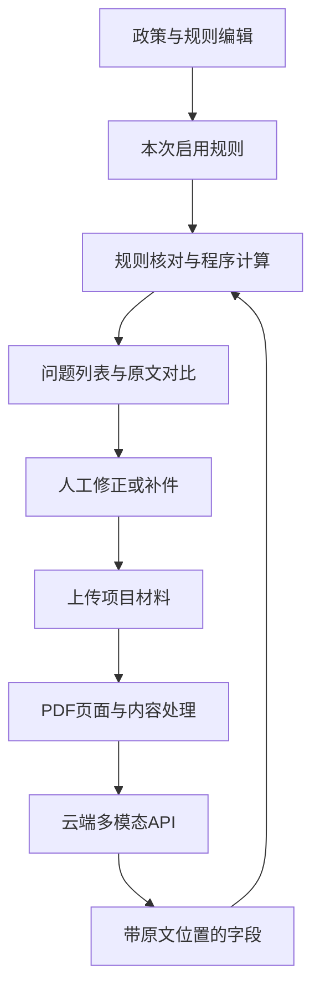

# 规证AI——高校项目申报材料形式审查应用

更新日期：2026-09-14。用途：校内比赛开发与展示。

## 1. 当前目标

把政策和申报材料变成可操作的审查结果，跑通“上传材料 → 发现问题 → 查看原文 → 人工修正 → 再次审查”的完整应用。

开发阶段先用云端 API。Qwen3.8 的视觉能力直接作为可用能力使用；应用完成后再考虑本地 vLLM 部署。

本文确定产品方向和必要行为。框架、接口、表结构、Prompt、任务编排与参数随实现调整。分支 `feat/w1-app-foundation` 已提供可运行的应用基础（项目持久化与服务端图像调用）；PDF 审查主链路仍待后续分支，合入前以该分支验收记录为准。
## 2. 用户与功能范围

主工作台面向学院科研秘书，教师可以提交材料、查看问题并上传修订版；政策维护入口用于编辑本次审查依据。

首版围绕一个申报批次，优先完成以下功能。

| 功能 | 用户得到什么 |
|---|---|
| 材料上传 | 多份 PDF 组成一个项目包，显示文件类别和处理状态 |
| 政策与规则 | 上传政策，AI 提取候选要求，用户查看原文、修改并启用 |
| 形式审查 | 核对必需材料、项目名称、负责人、金额、预算合计、日期和条件附件 |
| 证据定位 | 点击问题即可打开对应文件和页面，定位相关文字或区域 |
| 跨文件对比 | 并列展示两个来源、原始值、单位换算与差异 |
| 人工处理 | 确认问题、修正提取值、标记不适用、补充说明 |
| 修订重审 | 上传新版本，再次审查，查看问题是否解决 |
| 补正清单 | 汇总问题、政策依据、材料位置和修改建议，供查看或导出 |

匿名要求、签章存在性、更多类别规则按所选批次需要增加。系统辅助形式审查，不给学术价值打分，不认定签名真伪或最终申报资格。

## 3. 第一条可运行链路

先选申报书与预算表的申请经费一致性检查。

1. 上传两份 PDF，打开页面预览。
2. 模型读取申请经费，返回原文、单位、页码和位置。
3. 程序把“30万元”和“300000元”换算成相同单位。
4. 生成结果卡；不一致时显示两处原文和差额。
5. 修改材料并重审，保存修订前后的结果。

“项目总经费”和“申请经费”分别提取，按字段含义比较。暂时可以使用手工配置的一条规则，政策自动提取随后接入。

## 4. 应用结构



先采用一个 Web 应用、一个后端和必要的后台任务处理。政策、文档、模型调用、规则计算和结果管理保持清楚的模块边界即可。

数据库保存政策、材料索引、审查结果和人工修改；文件放后端管理的存储目录或对象存储。数据库与文件存储的具体选型由实现决定。

Pi / pi-ai 可用于模型和工具调用，直接 SDK 也可先完成链路。业务数据不依赖特定运行时类型。

## 5. 模型接入与文档定位

### 云端 API

后端集中配置服务地址、模型名和密钥，提供图像输入与结构化结果处理。先接一个可用服务；实际供应商与模型 ID 由接入配置确定。密钥只放服务端。

Prompt 随实际输入和返回结构编写，需要什么字段就提取什么字段。对缺失或无法读取的值保留原因，遇到具体问题再调整提示词或读取路径。

请求失败时显示可理解的错误并允许重试；保留排查所需的请求标识和错误摘要即可。性能优化围绕已经影响使用的等待或重复调用处理。

### PDF 与原文位置

首版支持数字、扫描及混合 PDF。按需渲染页面供视觉模型读取，原生文本可辅助提取和搜索；ZIP、Office 等输入按实际材料需要增加。

应用内部可统一用页面左上角为原点的 `[x1, y1, x2, y2]`，各轴归一化到 0—1000。按同一参考页面的宽高映射到显示位置。

```text
x = x_norm / 1000 × page_width
y = y_norm / 1000 × page_height
```

模型位置与前端高亮使用同一页面方向和尺寸；缩放、旋转由页面显示层统一处理。接入时检查返回字段、页码、坐标范围及高亮是否对齐。

原文读取清楚时直接用于核对；遇到缺页、模糊或字段含义不清时显示具体待确认项，必要时重读局部区域。

## 6. 规则和结果

### 政策规则

每条规则保留名称、政策出处、适用条件、比较对象和要求。AI 生成候选规则，用户可以查看、修正和启用；开发中可以先使用现成规则。

金额、日期、合计、相等与附件条件由程序处理。金额比较前统一单位，未知值不当作零；程序只执行已支持的计算，不执行模型生成的任意代码。算子按功能需要增加。

规则调整后记录版本；每次审查绑定使用的规则与材料版本，旧结果仍可查看。

### 结果口径

| 状态 | 含义 |
|---|---|
| PASS | 本条适用规则已检查，满足要求 |
| FAIL | 有明确冲突，或在已提交完整范围内确认缺少必需材料 |
| NEED_HUMAN_REVIEW | 字段、适用条件或材料内容无法确定，需人工确认 |
| NOT_APPLICABLE | 有明确依据表明本条不适用 |
| WARNING | 非强制建议或提醒 |
| SYSTEM_ERROR | 解析、请求或任务执行失败，需要重试或修复 |

上传未完成或文件无法读取时，不把“尚未找到”当成“确认缺件”。一条规则的明确问题可以先展示，其他未完成检查继续保留状态。

工作台分别显示已检查项、问题、待确认项与未完成项。检查范围以本次启用的规则和材料为准，未运行规则不计为通过。

### 最少保留的信息

| 对象 | 需要保留什么 |
|---|---|
| Rule | 规则内容、政策出处、版本 |
| Material | 项目包、文件、版本、处理状态 |
| Evidence | 文件、页码、原文、区域位置（可用时） |
| Fact | 字段含义、原始值、单位、规范化值、来源 |
| Finding | 对应规则、状态、原因、证据、比较过程 |
| HumanDecision | 修改内容、操作者、时间、说明 |

这些是信息需求，具体字段名、存储方式和接口在前后端联调时确定。

## 7. 页面与操作

- **上传页**：创建项目，添加文件，确认类别，选择政策，开始审查。
- **规则页**：政策原文与候选规则对应展示，支持编辑和启用。
- **审查页**：显示进度、需修改问题、待确认项和已检查项。
- **证据视图**：问题与原文并列；跨文件问题可查看两个来源及换算过程。
- **修订记录**：查看人工修改、新材料版本和再次审查结果。

错误提示说明失败文件或操作及下一步。模型回合、工具调用和内部校验标签留在开发调试信息中。

## 8. 重审与基本工程要求

首版对修订后的材料整包重审。保留历史结果，并展示问题已解决、仍存在或新增；精细增量依赖计算后续按需要做。

文件读取按项目权限控制，文档正文作为待处理资料，不作为系统操作指令。普通日志不打印密钥和整份材料。失败、取消和重新运行要有明确状态，新任务结果不覆盖旧版本记录。

## 9. 开发材料与必要检查

现有输入位于 [开发材料索引](docs/kickoff/02_政策与材料索引.md)：1份模拟指南、3套模拟材料、10条规则和30个场景说明。按当前功能选用场景、制作变体，并准备对应PDF用于页面联调。

按正在实现的功能选取相关例子，确认上传、提取、计算、定位、人工修改和重审能用。规则计算或状态处理出现问题时补对应检查。

比赛材料展示实际完成的功能与运行结果。

## 10. 开发顺序与交付

分支安排、依赖与验收标准见 [八周开发计划](docs/competition-review/第一轮全面诊断与八周行动计划.md)。

- [ ] 两份 PDF 的金额核对、原文定位和结果卡跑通。
- [ ] 政策上传、候选规则编辑与启用可用。
- [ ] 主批次常用形式检查可用。
- [ ] 人工修正、补件与再次审查可用。
- [ ] 补正清单和历史结果可查看或导出。
- [ ] 应用可启动、演示，主要失败情况可处理。

应用完成后，再根据比赛网络和部署需求考虑本地 vLLM。切换时复用现有模型接入层。
